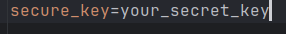
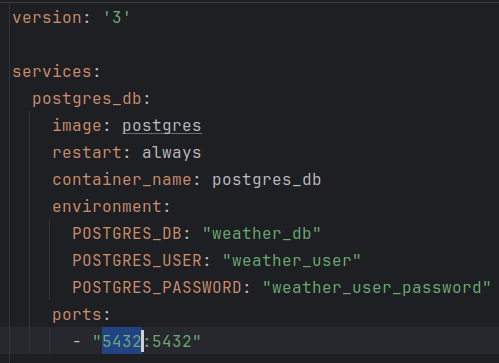
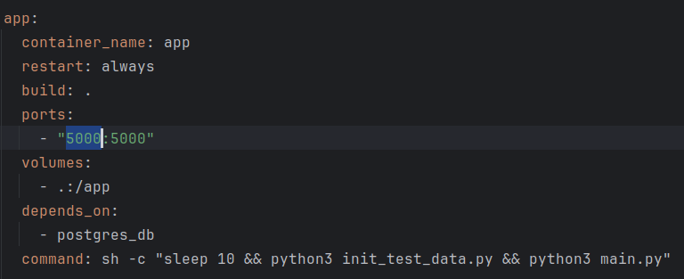
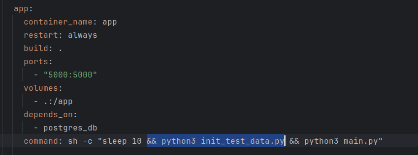

# IT-Planet_If_else_Duvakin

## Компания «История Погоды»

### Условия

Участник предоставляет Организатору разрешение на использование, модификацию, публикацию проекта и дальнейшее
распространение, включая право на внесение изменений, дополнений, предисловий, комментариев и любых других переработок.
Участник гарантирует, что проект не нарушает действующее законодательство, не содержит информации, дискредитирующей лиц
или продукты, не вызывает судебных исков или претензий, не нарушает прав и интересов третьих лиц, соответствует
общественным интересам, принципам гуманности и морали. Участник подтверждает, что все используемые в проекте материалы и
данные являются его собственностью или использованы с разрешения правообладателей, что не ограничивает использование
проекта Организатором в полном объеме.
Участник подтверждает, что передача исключительных прав на проект, созданный в рамках конкурса, не нарушает права
третьих лиц и что все материалы проекта могут быть использованы Организатором без каких-либо ограничений.

### Описание системы

Система представляет собой сервис API, разработанный на Flask с использованием PostgreSQL и Docker, который предназначен
для сбора, хранения и анализа метеорологических данных. Система включает в себя следующие компоненты:

* Flask API: Основная часть системы, предоставляющая HTTP-интерфейс для взаимодействия с метеорологической информацией.
  Flask обрабатывает запросы от клиентов и возвращает соответствующие данные.

* PostgreSQL: Реляционная база данных, используемая для хранения всех метеорологических данных, а также информации о
  пользователях и других сущностях системы.

* Docker: Используется для контейнеризации приложения, что облегчает его развертывание и масштабирование.

Структура проекта включает в себя различные файлы и директории, такие как файлы Flask приложения, модели данных, скрипты
для генерации тестовых данных, а также файлы конфигурации Docker и зависимости в файле requirements.txt.

Общая цель системы состоит в том, чтобы предоставить удобный и надежный способ сбора, хранения и доступа к
метеорологической информации для дальнейшего анализа и использования.

### Запуск системы

Перед запуском системы убедитесь, что на вашем компьютере установлены Docker и Docker Compose. Если они не установлены,
следуйте инструкциям на [официальном сайте Docker](https://www.docker.com/) для вашей операционной системы.

Также обратите внимание, что для запуска потребуется подключение к интернету. Для работы приложения буду скачан образ
СУБД PostgreSQL и необходимые зависимости (библиотеки).

Для работы приложения необходимо задать ключ шифрования, для этого нужно создать файл ".env" с определенной внутри
переменной "secure_key". Это не является обязательным условием т.к. в случае отсутствия переменной окружения система
сгенерирует ключ случайным образом. Пример [.env](.env) файла.



Для запуска система откройте терминал в папке [WeatherService](WeatherService) и запустите одну из команд:  
`docker compose up` или `docker-compose up`  
Начнется запуск системы. Обратите внимание, что даже если Docker сообщает о запуске контейнеров, для запуска программы
внутри контейнеров может потребоваться дополнительное время, до 20 секунд.

Обратите внимание, что для работы система использует порты 5432 и 5000. Если во время запуска данные порты будут заняты
другими программами, то будет вызвано исключение. Для изменения портов, по которым может быть доступен API сервис и база
данных измените первую часть параметра "ports" в файле [docker-compose.yml](WeatherService%2Fdocker-compose.yml) у базы
данных и приложения.

### Для базы данных:



### Для API:



### Заполнение тестовыми данными

Для удобства тестирования при первом запуске контейнера происходит заполненые базы тестовыми данными. Создается новый
пользователь для возможности быстрой авторизации.

Данные авторизации тестового пользователя:  
{  
"email": "test@user.ru",  
"password": "test_password"  
}

Автоматическое заполнение базы можно отключить убрав команду `&& python3 init_test_data.py` из
файла [docker-compose.yml](WeatherService%2Fdocker-compose.yml).



### Готовые тесты Postman

Для автоматизации тестирования можно воспользоваться подготовленной коллекцией запросов
Postman v2.1: [ItPlanet.postman_collection.json](postman_collection%2FItPlanet.postman_collection.json).
Запросы написаны для тестовых данных, которые добавляются в базу данных автоматически при первом запуске контейнера.

## Методы

### Создание пользователя

Метод: **POST**

Путь: **/registration**

#### Запрос

Принимает JSON-объект с полями:

- **firstName** (обязательно): Имя пользователя.
- **lastName** (обязательно): Фамилия пользователя.
- **email** (обязательно): Адрес электронной почты пользователя.
- **password** (обязательно): Пароль от аккаунта пользователя.

#### Ответ

В случае успешного создания пользователя возвращает JSON-объект с полями:

- **id**: Идентификатор аккаунта пользователя.
- **firstName**: Имя пользователя.
- **lastName**: Фамилия пользователя.
- **email**: Адрес электронной почты.

#### Статусы

- **201**: Запрос успешно выполнен.
- **400**:
  - Если отсутствуют обязательные поля в теле запроса.
  - Если поля `firstName`, `lastName`, `email` или `password` пусты или состоят только из пробелов.
  - Если адрес электронной почты некорректен.
- **403**: Запрос от авторизованного аккаунта.
- **409**: Аккаунт с таким адресом электронной почты уже существует.

Пример запроса:

```json
{
  "firstName": "John",
  "lastName": "Doe",
  "email": "john.doe@example.com",
  "password": "password123"
}
```

Пример успешного ответа:  
```json
{
  "id": 123,
  "firstName": "John",
  "lastName": "Doe",
  "email": "john.doe@example.com"
}
```